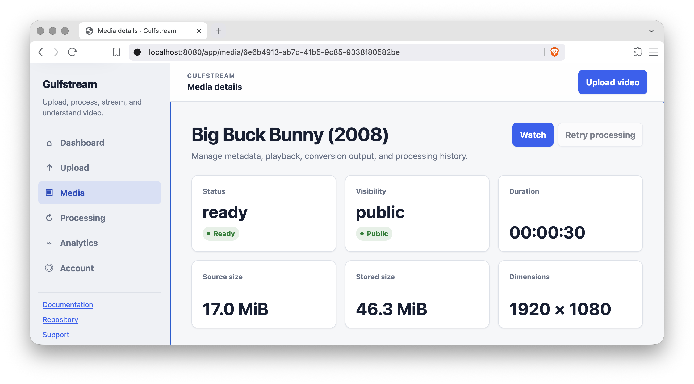

# Gulfstream



Gulfstream is a configurable Rust video API and responsive management application for account management, direct uploads, protected URL imports, durable FFmpeg processing, adaptive HLS playback, and persisted analytics.

- **Repository:** <https://github.com/gulfstream-rs/gulfstream>
- **Documentation:** <https://gulfstream-rs.github.io/gulfstream/>
- **OpenAPI:** served by each running instance at its configured OpenAPI route
- **Rustdoc:** <https://gulfstream-rs.github.io/gulfstream/rustdoc/gulfstream/>
- **Changelog:** [CHANGELOG.md](CHANGELOG.md)

## Features

- Email/password account registration and login
- Configurable open, administrator-token, or disabled registration
- HttpOnly browser sessions with CSRF protection, absolute expiry, idle expiry, and session limits
- Revocable bearer API keys stored as Argon2id verifiers
- Streaming multipart uploads with size, content-type, filename, checksum, and quota enforcement
- Protected remote imports with DNS/redirect revalidation, SSRF controls, bounded timeouts, byte limits, and optional proxy use
- Durable SQLite-backed jobs with leasing, renewal, retries, cancellation, and publication fencing
- Real FFprobe inspection and FFmpeg adaptive HLS conversion
- Configurable renditions, codecs, bitrates, GOP alignment, segment duration, fMP4 or MPEG-TS output, retention, and extra arguments
- Public, unlisted, and private media with short-lived signed playback authorization
- HTML5 playback, HLS assets, original-source streaming, and HTTP byte ranges
- Persisted views, unique viewers, play starts, completed views, watch time, and bytes actually emitted
- Configurable analytics retention and reporting windows
- Responsive, accessible, dependency-free management dashboard for every operator workflow
- Runtime-resolved OpenAPI 3.1 contract
- Docker, Docker Compose, GitHub Actions, crates.io release automation, VitePress documentation, Rustdoc, and Dependabot

## Quick start

Docker Compose is the fastest supported launch path. FFmpeg and FFprobe are included in the runtime image.
The container's bundled media tools and runtime retain their own licenses as documented in `THIRD_PARTY_NOTICES.md`.

```bash
git clone https://github.com/gulfstream-rs/gulfstream.git
cd gulfstream

cp config/gulfstream.example.toml config/gulfstream.toml
{
  printf '%s\n' 'GULFSTREAM_CONFIG=config/gulfstream.toml'
  ./scripts/generate-secrets.sh
} > .env

docker compose up --build
```

Open:

- Web application: `http://localhost:8080/app`
- OpenAPI: `http://localhost:8080/openapi.yaml`
- Readiness: `http://localhost:8080/health/ready`

The example configuration uses administrator-token registration. Enter the `GULFSTREAM_ADMIN_TOKEN` value from `.env` on the registration page.

For unrestricted registration, set:

```toml
[registration]
mode = "open"
```

For complete installation, configuration, production, and API instructions, read the [documentation](https://gulfstream-rs.github.io/gulfstream/).

## Run from source

Requirements:

- Rust 1.97.1
- FFmpeg and FFprobe
- a C/C++ build environment required by the selected Rust target

```bash
cp config/gulfstream.example.toml config/gulfstream.toml
./scripts/generate-secrets.sh > .env
set -a
. ./.env
set +a
cargo run --release -- --config config/gulfstream.toml
```

`GULFSTREAM_CONFIG=config/gulfstream.toml cargo run --release` is equivalent.

## First API request

Register and sign in through the web interface, create an API key under **Account**, and copy it immediately. The plaintext key is not stored and cannot be shown again.

```bash
export GULFSTREAM_API_KEY='gfs_…'

curl \
  -H "Authorization: Bearer $GULFSTREAM_API_KEY" \
  http://localhost:8080/api/dashboard
```

Upload one video:

```bash
curl -X POST http://localhost:8080/api/media \
  -H "Authorization: Bearer $GULFSTREAM_API_KEY" \
  -F 'file=@video.mp4;type=video/mp4' \
  -F 'title=Example video' \
  -F 'description=Uploaded through the API' \
  -F 'visibility=private'
```

The source is durably stored before a transcode job is queued. Poll the returned media resource or processing jobs until the media status becomes `ready` or `failed`.

## Web application

The web application uses no frontend framework or separate backend. A server-rendered shell loads modular CSS and ES modules that call the same public API used by external clients. Available pages cover:

- registration and login
- dashboard metrics, storage usage, status breakdowns, and automatic refresh
- drag-and-drop upload with progress and protected URL import
- responsive media search, filters, configurable pagination, details, editing, playback, retry, and safe deletion
- durable processing jobs with status filters and automatic refresh
- analytics totals, completion metrics, and daily charts
- account profile, one-time API-key display/copy, revocation, and logout

Routes, branding, external links, feature flags, limits, registration policy, and CSRF header names are injected from validated server configuration.

## Configuration

Copy `config/gulfstream.example.toml` and modify it for the environment. Gulfstream has no hidden runtime defaults: every required field must be present and valid. Configuration covers:

- listener, public URL, CORS, request limits, and shutdown
- every public route prefix
- web templates, assets, branding, links, and cache policy
- SQLite pool and durability settings
- durable, temporary, stream, original, and trash storage
- registration, passwords, sessions, cookies, CSRF, API keys, and playback tokens
- upload and protected import controls
- worker concurrency, leases, retries, and polling
- FFmpeg/FFprobe commands, rendition profiles, codecs, HLS packaging, and retention
- analytics cookies, heartbeat limits, reporting, and retention
- player template and optional hls.js URL
- tracing filters and JSON logs

`${VARIABLE}` placeholders inside TOML strings are resolved from the environment. Missing variables fail startup.

## Documentation development

The documentation site uses VitePress `2.0.0-alpha.19` and Node.js 22 or newer.

```bash
cd docs
npm ci
npm run docs:dev
```

Build it with:

```bash
npm run docs:build
```

## Quality commands

Run the complete local gate:

```bash
make verify
```

Or run each step directly:

```bash
cargo fmt --all -- --check
cargo check --all-targets --all-features
cargo clippy --all-targets --all-features -- -D warnings
cargo test --all-targets --all-features
RUSTDOCFLAGS="-D warnings" cargo doc --no-deps --all-features
cargo build --release
cargo publish --dry-run
node scripts/validate-web.mjs
```

Contributor workflow and review expectations are documented in [CONTRIBUTING.md](CONTRIBUTING.md).

## Release automation

- `ci.yml` validates web assets, formats, checks, lints, tests, builds Rustdoc and release artifacts, performs a crates.io dry run, and builds VitePress.
- `docs.yml` publishes VitePress and generated Rustdoc to GitHub Pages from `main`.
- `publish-crates.yml` validates a published GitHub release tag and publishes the matching package to crates.io with short-lived OIDC credentials from crates.io trusted publishing.
- `security.yml` enforces license, source, ban, and advisory policy with cargo-deny.
- Dependabot checks Cargo, npm, and GitHub Actions dependencies weekly.

Before enabling documentation deployment, select **GitHub Actions** as the Pages source. Before automated crates.io releases, complete the one-time package bootstrap described in the [release guide](docs/guide/releasing.md), create the `crates-io` GitHub environment, and configure the corresponding crates.io trusted publisher. No long-lived registry token is stored in GitHub.

## Storage and database

SQLite stores accounts, hashed credentials, media metadata, renditions, durable jobs, browser sessions, playback sessions, raw events, exact unique-viewer rows, and daily aggregates. Filesystem storage contains originals and generated HLS assets.

Back up the database and storage tree as one consistency unit. The worker publication path uses staging directories and state/lease checks so incomplete or stale work is not exposed as ready media.

## Security

Read [SECURITY.md](SECURITY.md) before production deployment. At minimum, terminate HTTPS, enable secure cookies, use independent high-entropy secrets, restrict CORS to exact origins, keep private-network imports disabled unless explicitly required, and run the service as an unprivileged user.

## License

MIT
